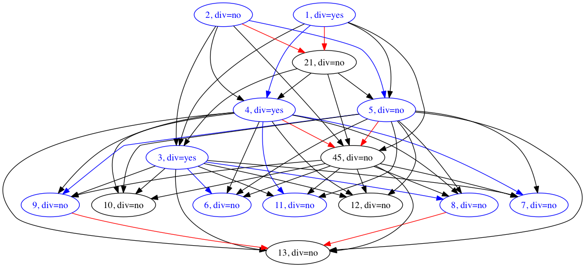

# Multi Hypothesis Tracking
by Carsten Haubold, 2015

This is a standalone tool for running tracking of divisible objects, with competing detection hypotheses in each frame.
When specifying a ground truth labeling for a dataset, the weights can be learned using structured learning 
(by [OpenGM's](http://github.com/opengm/opengm) implementation of [SBMRM](https://github.com/funkey/sbmrm)).
The tracking problem is then solved as ILP by Gurobi or CPLEX, depending on how this tool was compiled.

## Binaries

The `bin` folder contains the tools that can be run from the command line. 
All of the tools use JSON file formats as input and output (see below). Invoke them once to see usage instructions.

* `train`: given a graph and the corresponding ground truth, return the best weights
* `track`: given a graph and weights, return the best tracking result

**Example:**
```
$ ls
>>> gt.json	track	Makefile	model.json	train
$ ./train -m model.json -g gt.json -w weights.json
>>> lots of output...
$ ./track -m model.json -w weights.json -o trackingresult.json
```

## JSON file formats

* Graph description: [test/magic.json](test/magic.json)
	- arbitrary number of features allowed (in `[]`), their weights 
* Tracking Result = Ground Truth format: [test/gt.json](test/gt.json)
* Weight format: [test/weights.json](test/weights.json)

## Dot output

After calling `Model::toDot(filename, solution)`, the resulting `*.dot` file can be transformed to e.g. PDF by invoking:

```
dot -Tpdf result.dot > result.pdf
```

The graph should then look as below, where blue nodes and edges indicate that they were used in the solution, 
black ones are unused, and red edges display mutual exclusions.
